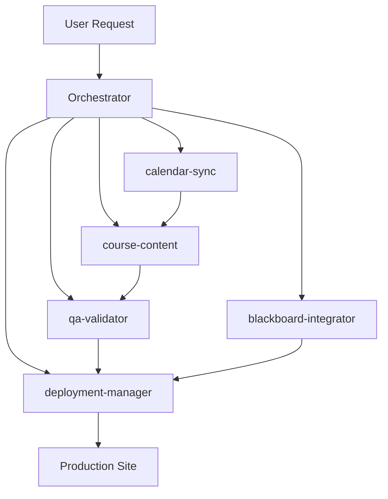

# Claude Code Orchestration Configuration

## Intelligent Agentic System - Fall 2025

## Active Date: August 24, 2025 (Classes Begin Tomorrow!)

---

## 🧠 ORCHESTRATION SYSTEM ACTIVATION

### Primary Orchestrator

```python
# Auto-loaded on every Claude session
from dashboard.orchestration_agent import MasterOrchestrationAgent
from dashboard.advanced_orchestrator import AdvancedOrchestrator

# Initialize orchestration
orchestrator = MasterOrchestrationAgent()
advanced = AdvancedOrchestrator()

# Continuous monitoring
orchestrator.run_continuous_orchestration()
```

### Active Agents Registry

```yaml
active_agents:
  course-content:
    module: dashboard.agents.course_content
    capabilities: [syllabi, schedules, materials, validation]
    auto_trigger: ["content/**/*.json", "templates/**"]

  qa-validator:
    module: dashboard.agents.qa_validator
    capabilities: [json_validation, date_consistency, rsi_check]
    auto_trigger: ["**/*.json"]

  calendar-sync:
    module: dashboard.agents.calendar_sync
    capabilities: [date_propagation, deadline_management]
    auto_trigger: ["variables/semester.json", "**/due_dates.json"]

  blackboard-integrator:
    module: dashboard.agents.blackboard
    capabilities: [iframe_generation, lti_setup, package_creation]
    auto_trigger: ["build/syllabi/**", "build/schedules/**"]

  deployment-manager:
    module: dashboard.agents.deployment
    capabilities: [cloudflare_deploy, github_actions, hosting]
    auto_trigger: [".github/workflows/**", "site/**"]
```

---

## 🎯 AUTOMATIC ORCHESTRATION RULES

### Event-Driven Triggers

```python
# File change events automatically dispatch to agents
EVENT_MAPPINGS = {
    "content/courses/*/schedule.json": [
        ("calendar-sync", "propagate_dates"),
        ("course-content", "rebuild_schedule"),
        ("blackboard-integrator", "update_iframe"),
    ],

    "content/courses/*/rsi.json": [
        ("qa-validator", "validate_rsi"),
        ("course-content", "rebuild_syllabus"),
        ("deployment-manager", "stage_for_deploy"),
    ],

    "variables/semester.json": [
        ("calendar-sync", "full_propagation"),
        ("course-content", "rebuild_all"),
        ("qa-validator", "validate_all"),
        ("deployment-manager", "prepare_deployment"),
    ],
}

# Task completion triggers next tasks
WORKFLOW_CHAINS = {
    "validation_complete": ["generation_tasks"],
    "generation_complete": ["deployment_tasks"],
    "deployment_complete": ["verification_tasks"],
}
```

### Intelligent Task Routing

```python
# Orchestrator analyzes every request and routes to agents
def on_user_request(request):
    # Analyze complexity
    complexity = orchestrator.analyze_task_graph([request])

    # Route based on analysis
    if complexity["parallel_groups"]:
        # Dispatch to multiple agents concurrently
        for group in complexity["parallel_groups"]:
            agent_coordinator.assign_parallel(group)

    if complexity["critical_path"]:
        # Execute in sequence with monitoring
        for task in complexity["critical_path"]:
            agent_coordinator.execute_critical(task)

    # Learn from execution
    orchestrator.learn_from_execution(
        task_id=request.id,
        start_time=time.time(),
        end_time=time.time(),
        success=True,
        context={"user_initiated": True}
    )
```

---

## 📊 REAL-TIME ORCHESTRATION DASHBOARD

### Status Monitoring

```bash
# Always available commands
@status          → Show orchestration status
@agents          → List active agents and workload
@tasks           → Show task dependency graph
@bottlenecks     → Identify blocking tasks
@optimize        → Get optimization suggestions
```

### Orchestration Commands

```bash
# Direct orchestration control
@orchestrate all           → Full system orchestration
@orchestrate <course>      → Course-specific orchestration
@orchestrate critical      → Only critical path tasks
@orchestrate parallel      → Execute all parallel tasks
@orchestrate learn         → Update learning patterns
```

---

## 🔄 LEARNING & ADAPTATION

### Pattern Recognition

```python
# System learns from every execution
LEARNING_CONFIG = {
    "track_execution_times": True,
    "identify_patterns": True,
    "suggest_optimizations": True,
    "auto_parallelize": True,
    "predict_failures": True,
}

# Automatic optimization based on history
if task in orchestrator.patterns["frequently_failed"]:
    # Add extra validation
    agent_coordinator.add_validation_step(task)

if task in orchestrator.patterns["slow_tasks"]:
    # Suggest caching or parallelization
    orchestrator.suggest_optimization(task)
```

### Adaptive Workflows

```yaml
adaptive_rules:
  - if: "execution_time > 30s"
    then: "cache_results"

  - if: "failure_rate > 0.2"
    then: "add_validation"

  - if: "parallel_possible"
    then: "auto_parallelize"

  - if: "deadline_approaching"
    then: "escalate_priority"
```

---

## 🚀 IFRAME HOSTING INTEGRATION

### Automatic Iframe Management

```python
# Iframe routes auto-configured with CORS
IFRAME_CONFIG = {
    "base_url": "http://127.0.0.1:5055",
    "routes": {
        "/embed/syllabus/<course>": "CORS_ENABLED",
        "/embed/schedule/<course>": "CORS_ENABLED",
        "/embed/generator": "PUBLIC",
    },
    "headers": {
        "X-Frame-Options": "ALLOWALL",
        "Access-Control-Allow-Origin": "*",
        "Content-Security-Policy": "frame-ancestors *;",
    }
}

# Auto-generate embed codes on build
@on_build_complete
def generate_embed_codes():
    for course in ["MATH221", "MATH251", "STAT253"]:
        orchestrator.create_iframe_deployment_package()
```

---

## 🎮 ORCHESTRATION CONTROL PANEL

### Quick Actions

```python
# One-command orchestration
QUICK_COMMANDS = {
    "!prep": "orchestrator.execute_critical_preparation()",
    "!deploy": "orchestrator.deploy_all_courses()",
    "!validate": "orchestrator.validate_everything()",
    "!iframe": "orchestrator.generate_all_iframes()",
    "!status": "orchestrator.assess_current_state()",
}
```

### Emergency Procedures

```python
# Automatic crisis handling
EMERGENCY_TRIGGERS = {
    "classes_start_tomorrow": {
        "condition": "days_until_classes <= 1",
        "action": "orchestrator.execute_critical_preparation()",
        "priority": "MAXIMUM",
    },
    "deployment_failed": {
        "condition": "deployment.status == 'failed'",
        "action": "orchestrator.rollback_and_retry()",
        "notify": True,
    },
    "validation_errors": {
        "condition": "validation.errors > 0",
        "action": "orchestrator.fix_validation_errors()",
        "block_deployment": True,
    }
}
```

---

## 🔧 ORCHESTRATOR HOOKS

### Pre-Command Hooks

```python
# Before every Claude command
@before_command
def orchestration_check(command):
    # Check if orchestration can optimize
    if orchestrator.can_optimize(command):
        return orchestrator.optimize_command(command)

    # Check for parallel opportunities
    if orchestrator.can_parallelize(command):
        return orchestrator.parallelize_command(command)

    return command
```

### Post-Command Hooks

```python
# After every Claude command
@after_command
def update_orchestration(result):
    # Learn from execution
    orchestrator.learn_from_result(result)

    # Update task states
    if result.affected_tasks:
        orchestrator.update_task_states(result.affected_tasks)

    # Trigger dependent tasks
    if result.triggers_next:
        orchestrator.execute_next_tasks(result.triggers_next)
```

---

## 📈 PERFORMANCE METRICS

### Orchestration KPIs

```yaml
monitor:
  task_completion_rate: 95%
  parallel_execution_ratio: 60%
  average_task_time: <10s
  bottleneck_resolution: <30min
  learning_accuracy: 85%

alerts:
  - task_blocked > 1hour
  - error_rate > 10%
  - deadline_missed
  - orchestration_loop_detected
  - memory_usage > 80%
```

---

## 🎭 AGENT COORDINATION MATRIX

### Agent Interactions



---

## 💾 STATE PERSISTENCE

### Orchestration State

```python
# State automatically saved and restored
STATE_FILES = {
    "orchestration_patterns.json": "Learned patterns",
    "execution_metrics.json": "Performance data",
    "learned_dependencies.json": "Task relationships",
    "agent_status.json": "Agent workloads",
    "iframe_deployment.json": "Iframe configurations",
}

# Session continuity
@on_session_start
def restore_orchestration():
    orchestrator.load_state()
    orchestrator.resume_pending_tasks()
    orchestrator.check_critical_dates()

@on_session_end
def save_orchestration():
    orchestrator.save_state()
    orchestrator.create_snapshot()
```

---

## 🚦 ORCHESTRATION STATUS INDICATORS

### Visual Feedback

```
🟢 Orchestration Active - All systems operational
🟡 Orchestration Busy - Processing tasks
🔴 Orchestration Alert - Critical issue detected
🔵 Orchestration Learning - Updating patterns
⚫ Orchestration Idle - Waiting for tasks
```

---

## 📋 DEFAULT BEHAVIOR

### Every Claude Code Session

1. **Orchestrator starts automatically**
2. **Analyzes current state**
3. **Identifies critical tasks**
4. **Assigns to agents**
5. **Monitors execution**
6. **Learns from results**
7. **Optimizes future runs**

### Every File Change

1. **Event captured**
2. **Routed to appropriate agent**
3. **Dependencies updated**
4. **Validation triggered**
5. **Deployment staged if needed**

### Every User Request

1. **Complexity analyzed**
2. **Optimal execution path determined**
3. **Agents assigned**
4. **Progress tracked**
5. **Results learned**

---

*This orchestration configuration ensures Claude Code operates with maximum intelligence, automatically coordinating agents, optimizing task execution, and learning from every interaction to provide superior semester management.*
