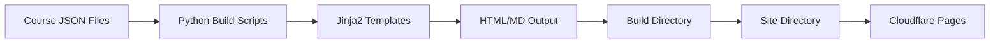
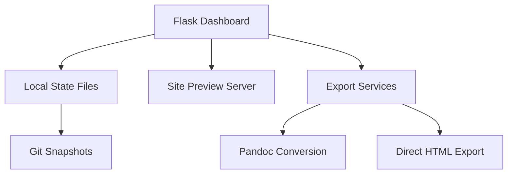

# Complete Architecture and Structure Report
## Fall 2025 Semester Course Management System

**Generated:** August 25, 2025  
**Project:** semester-2025-fall  
**Purpose:** Comprehensive documentation of project architecture, file organization, and system design

---

## Executive Summary

This project is a sophisticated course management and content delivery system designed for online course administration at an academic institution. It combines static site generation, dynamic dashboard functionality, automated content building, and cloud deployment into a cohesive platform for managing three courses: MATH221 (Applied Calculus), MATH251 (Calculus I), and STAT253 (Applied Statistics).

The system emphasizes production-ready content generation with Blackboard LMS compatibility, featuring automated scheduling, multiple export formats, and a comprehensive task management dashboard for course preparation workflow.

---

## 1. Project Architecture Overview

### 1.1 Core Components

The system is built on four primary architectural pillars:

1. **Content Management System** - JSON-based course data storage
2. **Build Pipeline** - Python-based static site generation
3. **Dashboard Application** - Flask-based administrative interface  
4. **Deployment Infrastructure** - Cloudflare Pages with GitHub Actions

### 1.2 Technology Stack

- **Backend:** Python 3.12+ with uv package manager
- **Web Framework:** Flask 3.1+ with Jinja2 templating
- **Frontend:** Bootstrap 5.1.3, vanilla JavaScript
- **Build Tools:** Custom Python scripts, Pandoc for document conversion
- **CI/CD:** GitHub Actions, Cloudflare Pages
- **Development Tools:** Pre-commit hooks, mypy type checking

---

## 2. Directory Structure Deep Dive

### 2.1 Root Level Organization

```
semester-2025-fall/
├── assets/              # Static assets for production site
├── build/               # Build artifacts (gitignored)
├── ci/                  # CI/CD configuration files
├── cloudflare/          # Cloudflare deployment configuration
├── content/             # Source content for courses
├── dashboard/           # Flask dashboard application
├── docs/                # Project documentation
├── scripts/             # Build and utility scripts
├── site/                # Generated static site (gitignored)
├── templates/           # Jinja2 templates for content generation
└── tests/               # Test suite
```

### 2.2 Content Directory (`content/`)

The heart of the course data, organized by course code:

```
content/courses/
├── MATH221/
│   ├── course_meta.json      # Course metadata
│   ├── due_dates.json        # Custom due date overrides
│   ├── evaluation_tools.json # Grading breakdown
│   ├── policies.json         # Course policies
│   ├── rsi.json             # Regular Substantive Interaction
│   ├── schedule.json        # Weekly schedule structure
│   └── syllabus_data.json   # Syllabus-specific content
├── MATH251/                  # Same structure
└── STAT253/                  # Same structure
```

**Key Design Decisions:**
- JSON format for easy version control and programmatic access
- Separation of concerns (policies, schedule, evaluation separate)
- Override capability via `due_dates.json` for platform-specific dates

### 2.3 Assets Directory (`assets/`)

Production-ready static resources:

```
assets/
├── banners/             # Course banner images
├── css/
│   ├── course.css       # Root CSS with professional baseline
│   └── courses/         # Course-specific theme files
│       ├── MATH221.css  # Blue monochromatic theme
│       ├── MATH251.css  # Blue-to-green gradient theme
│       └── STAT253.css  # Purple-to-green data viz theme
├── icons/               # Favicon and app icons
├── js/
│   └── generator.js     # iframe generator for Blackboard
└── logos/               # Institutional branding
```

### 2.4 Dashboard Application (`dashboard/`)

A comprehensive Flask application with modular architecture:

```
dashboard/
├── __init__.py          # Flask app factory
├── app.py               # Main application entry
├── config.py            # Environment-aware configuration
├── orchestrator.py      # Task orchestration engine
├── agents/              # AI agent integrations
├── api/                 # RESTful API endpoints
├── services/            # Business logic services
├── state/               # Persistent state management
│   ├── tasks.json       # Task tracking
│   ├── courses.json     # Course configuration
│   └── events/          # Event logging
├── static/              # Dashboard UI assets
├── templates/           # Jinja2 templates
│   ├── dashboard.html   # Main dashboard view
│   ├── syllabus_preview.html
│   └── course_schedule.html
├── utils/               # Utility functions
└── views/               # View controllers
```

**Dashboard Features:**
- Task management with priority queuing
- Real-time document preview with iframe embedding
- Export functionality (HTML, DOCX, PDF)
- Git-backed state snapshots
- API for external integrations

### 2.5 Scripts Directory (`scripts/`)

Build automation and utilities:

```
scripts/
├── build_schedules.py   # Generate course schedules
├── build_syllabi.py     # Generate syllabi documents
├── site_build.py        # Orchestrate full site build
├── generate_dashboard_config.py
├── validate_json.py     # Validate course data
├── weekgen.py          # Generate weekly schedule
└── utils/              # Shared utilities
    ├── jinja_env.py    # Jinja2 environment setup
    └── semester_calendar.py  # Academic calendar logic
```

**Build Pipeline Flow:**
1. Load course JSON data
2. Apply semester calendar alignment
3. Process through Jinja2 templates
4. Generate HTML/Markdown outputs
5. Copy to site directory with proper structure

### 2.6 Templates Directory (`templates/`)

Jinja2 templates for content generation:

```
templates/
├── syllabus.html.j2         # HTML syllabus template
├── syllabus.md.j2           # Markdown syllabus template
├── course_schedule.html.j2  # HTML schedule template
├── course_schedule.md.j2    # Markdown schedule template
└── syllabus_preview.html    # Dashboard preview template
```

### 2.7 Build Directory (`build/`)

Intermediate build artifacts (gitignored):

```
build/
├── schedules/
│   ├── MATH221_schedule.html
│   ├── MATH221_schedule.md
│   └── ...
└── syllabi/
    ├── MATH221_syllabus.html
    ├── MATH221_syllabus_with_calendar.html
    └── ...
```

### 2.8 Site Directory (`site/`)

Final production-ready static site (gitignored):

```
site/
├── index.html           # Landing page
├── assets/              # Copied from root assets/
├── embed/
│   └── generator/       # iframe generator tool
└── courses/
    ├── MATH221/
    │   └── fall-2025/
    │       ├── syllabus/
    │       │   ├── index.html      # Full syllabus
    │       │   └── embed/
    │       │       └── index.html  # Embedded version
    │       └── schedule/
    │           ├── index.html      # Full schedule
    │           └── embed/
    │               └── index.html  # Embedded version
    ├── MATH251/         # Same structure
    └── STAT253/         # Same structure
```

---

## 3. Configuration Files

### 3.1 Project Configuration

- **pyproject.toml** - Python project metadata, dependencies via uv
- **.mcp.json** - Model Context Protocol server configuration
- **academic-calendar.json** - Semester dates and holidays
- **.pre-commit-config.yaml** - Code quality enforcement

### 3.2 Claude AI Integration

- **AGENTS.md** - Instructions for AI agents
- **.claude-code-config.md** - Claude Code preferences
- **.claude-orchestration-config.md** - Task orchestration rules
- **.claude-task-templates.md** - Reusable task patterns

### 3.3 CI/CD Configuration

```
.github/workflows/
├── ci.yml          # Continuous integration
├── pages.yml       # Cloudflare Pages deployment
├── release.yml     # Release automation
├── scheduled.yml   # Scheduled tasks
└── test.yml        # Test suite execution
```

---

## 4. Data Flow Architecture

### 4.1 Content Generation Pipeline



### 4.2 Dashboard Integration



---

## 5. Key Design Patterns

### 5.1 Separation of Concerns

- **Data Layer:** JSON files in `content/`
- **Logic Layer:** Python scripts in `scripts/`
- **Presentation Layer:** Templates and CSS
- **Application Layer:** Flask dashboard

### 5.2 Build Artifacts Hierarchy

1. **Source:** `content/courses/*/`
2. **Intermediate:** `build/`
3. **Production:** `site/`
4. **Deployed:** Cloudflare Pages

### 5.3 Multi-Format Support

Each document supports multiple output formats:
- HTML (full and embedded versions)
- Markdown
- DOCX (via Pandoc)
- PDF (planned)

### 5.4 Environment-Aware Configuration

- Development: Local Flask server, debug mode
- Testing: Automated CI pipeline
- Production: Static site on Cloudflare

---

## 6. Special Features

### 6.1 Blackboard LMS Optimization

- Embedded HTML versions without navigation
- Blackboard-compatible color palette
- iframe generation tool with proper attributes
- Mobile-responsive design considerations

### 6.2 Course Theming System

Each course has distinct visual identity:
- **MATH221:** Professional blue (#0066cc)
- **MATH251:** Blue-to-green gradient
- **STAT253:** Purple-to-green data visualization

### 6.3 Task Orchestration

- Dependency graph analysis
- Smart task prioritization
- Agent coordination system
- Progress tracking and reporting

### 6.4 Regular Substantive Interaction (RSI)

Compliance features for online education:
- RSI content in all syllabi
- Interaction tracking templates
- Federal compliance documentation

---

## 7. Security and Best Practices

### 7.1 Security Measures

- No secrets in repository (uses environment variables)
- File locking for concurrent access
- Input validation on all endpoints
- Secure iframe attributes

### 7.2 Code Quality

- Type hints throughout Python code
- Pre-commit hooks for formatting
- Comprehensive error handling
- Modular, testable architecture

### 7.3 Documentation

- Inline code documentation
- API documentation
- Architecture documentation (this document)
- User guides in `docs/`

---

## 8. Deployment Architecture

### 8.1 GitHub Actions Workflow

1. Push to main branch triggers build
2. Run tests and validation
3. Build static site
4. Deploy to Cloudflare Pages

### 8.2 Cloudflare Pages Configuration

- Custom domain: courses.jeffsthings.com
- Automatic HTTPS
- Global CDN distribution
- Build command: `make site`
- Output directory: `site/`

---

## 9. Development Workflow

### 9.1 Local Development

```bash
# Setup environment
uv sync

# Run dashboard
make dash

# Build site
make site

# Run tests
make test
```

### 9.2 Content Updates

1. Edit JSON files in `content/courses/`
2. Run `python scripts/build_syllabi.py`
3. Run `python scripts/build_schedules.py`
4. Run `python scripts/site_build.py`
5. Preview in dashboard
6. Commit and push for deployment

---

## 10. Future Extensibility

### 10.1 Designed for Growth

- Add new courses by creating new directories in `content/courses/`
- Extend templates without breaking existing content
- Plugin architecture in dashboard for new features
- API-first design enables external integrations

### 10.2 Planned Enhancements

- Student-facing portal
- Grade calculation tools
- Calendar synchronization
- Mobile application
- Analytics dashboard

---

## Conclusion

This architecture represents a mature, production-ready system that balances flexibility with structure. Every directory and file serves a specific purpose in the content delivery pipeline, from source JSON through to deployed HTML. The separation of concerns, comprehensive build system, and thoughtful organization enable both maintainability and extensibility for future academic terms.

The system successfully serves its primary mission: providing a professional, Blackboard-compatible course management platform with minimal manual intervention and maximum consistency across all course materials.

---

**Document Version:** 1.0  
**Last Updated:** August 25, 2025  
**Maintained By:** Course Infrastructure Team