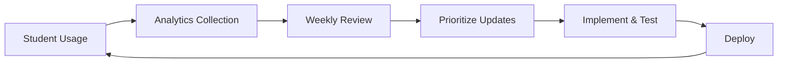

# Update Plan & Workflow for "A δ for your ε" Tool

> Got it — you’ve already got a long-term roadmap. If you only have **one solid hour today (Sep 1, 2025)**, the best move is to make a meaningful dent in the core infrastructure so the rest of your plan has traction. Here’s how I’d structure that hour with **agentic, outcome-oriented steps**:

## ⏱ One-Hour Sprint Plan

### Minute 0–5: Prep & Context

* Create a fresh branch:

  ```bash
  git checkout -b feature/katex-migration
  ```
* Open `site/interactive/math251/epsilon-delta.html` in your editor and browser (local http.server).
* Open your project board (or make a quick checklist).

### Minute 5–25: Vendor KaTeX Locally

* Install KaTeX locally via npm:

  ```bash
  npm install katex@^0.16.10
  ```
* Copy the dist files into your repo:

  ```bash
  mkdir -p site/interactive/_vendor/katex
  cp node_modules/katex/dist/katex.min.css site/interactive/_vendor/katex/
  cp node_modules/katex/dist/katex.min.js site/interactive/_vendor/katex/
  cp -r node_modules/katex/dist/fonts site/interactive/_vendor/katex/
  ```
* Update `<head>` in `epsilon-delta.html` (KaTeX vendor already included):

  ```html
  <link rel="stylesheet" href="../_vendor/katex/katex.min.css">
  <script defer src="../_vendor/katex/katex.min.js"></script>
  <script defer src="../_vendor/katex/contrib/auto-render.min.js"></script>
  <script defer src="../js/math-render.js"></script>
  ```

### Minute 25–40: Build `math-render.js`

```javascript
// js/math-render.js
function renderMathIn(el) {
  if (!el) return;
  try {
    renderMathInElement(el, {
      delimiters: [
        { left: "$$", right: "$$", display: true },
        { left: "$", right: "$", display: false },
        { left: "\\(", right: "\\)", display: false },
        { left: "\\[", right: "\\]", display: true }
      ],
      throwOnError: false
    });
  } catch (err) {
    console.warn("KaTeX render error:", err);
  }
}

// Initial render
document.addEventListener("DOMContentLoaded", () => {
  renderMathIn(document.body);
});
```

* Swap out `mathjax-loader.js` references in your HTML → replace with KaTeX.

### Minute 40–55: Quick Cypress Seed Test

* Install Cypress:

  ```bash
  npm install cypress --save-dev
  npx cypress open
  ```
* Create `cypress/e2e/epsilon-delta.cy.js`:

  ```javascript
  describe('Epsilon-Delta Tool', () => {
    it('renders math correctly', () => {
      cy.visit('http://localhost:8002/math251/epsilon-delta.html');
      cy.get('.tool-header').contains('A δ for your ε');
      cy.get('body').should('contain.text', 'ε');
    });
  });
  ```

### Minute 55–60: Verify & Commit

* Run local preview (`python -m http.server 8002`) → check math renders offline.
* Run Cypress test once.
* Commit and push:

  ```bash
  git add .
  git commit -m "feat: migrate to KaTeX local vendor + math-render helper"
  git push origin feature/katex-migration
  ```

## 🎯 Deliverables After 1 Hour

* ✅ KaTeX vendored locally (no CDN).
* ✅ `math-render.js` helper in place.
* ✅ HTML updated to use KaTeX.
* ✅ Seed Cypress test verifies tool loads and math renders.
* ✅ Branch pushed → ready for PR.

---

*MATH251 - Fall 2025 Implementation Roadmap*

## 📅 Timeline Overview
Given your Fall 2025 start date (August 25), here's a phased approach that allows for iterative improvements throughout the semester:

```
Phase 1: Core Infrastructure (June 2025) - Pre-semester prep
Phase 2: Pedagogical Enhancements (July 2025) - Summer testing
Phase 3: UX Polish (August 1-24, 2025) - Pre-launch refinement
Phase 4: Mid-Semester Updates (Oct 2025) - Based on student feedback
Phase 5: Spring 2026 Prep (Dec 2025) - Major feature additions
```

## 🎯 Phase 1: Core Infrastructure (June 2025)
**Goal:** Establish robust foundation and remove technical debt

### Week 1-2: Math Engine Migration
```javascript
// Task checklist:
□ Vendor KaTeX locally to site/interactive/_vendor/katex/
□ Create js/math-render.js helper with error handling
□ Replace all MathJax calls with synchronous KaTeX renders
□ Test offline functionality (no CDN dependencies)
□ Document KaTeX version in package.json
```

### Week 3-4: Automated Testing Framework
```yaml
# cypress/e2e/epsilon-delta.cy.js
□ Test slider interactions update graph
□ Test mode switching (Learn/Practice/Challenge)
□ Test localStorage persistence
□ Test Blackboard iframe embedding
□ Test keyboard navigation (Tab, Arrow keys)
□ Test responsive design breakpoints
```

### Deliverables:
- ✅ Zero CDN dependencies
- ✅ Cypress test suite (>80% coverage)
- ✅ CI/CD pipeline for Cloudflare Pages

## 🧠 Phase 2: Pedagogical Enhancements (July 2025)
**Goal:** Implement key learning improvements before semester

### Week 1: Counterexample Visualization
```javascript
// epsilon-delta.js additions:
function highlightCounterexample(x, fx) {
    // Draw pulsing red dot at violation point
    // Update guidance text with specific failure reason
    // Show algebraic inequality that fails
}
```

### Week 2: Challenge Mode Upgrade
```javascript
// New challenge mechanics:
□ Randomize ε at start of each round
□ Student must find appropriate δ
□ Score based on efficiency (optimal δ = max points)
□ Progress bar visualization
□ Leaderboard preparation (optional)
```

### Week 3: Algebra-Geometry Bridge Panel
```html
<!-- New panel in epsilon-delta.html -->
<div class="algebra-panel">
    <h3>Symbolic View</h3>
    <div id="inequality-display">
        |f(x) - L| = <span class="dynamic">0.42</span> < ε = <span class="epsilon-value">0.5</span> ✅
        0 < |x - c| = <span class="dynamic">0.18</span> < δ = <span class="delta-value">0.2</span> ✅
    </div>
</div>
```

### Week 4: Sandbox Mode
```javascript
// New mode configuration:
sandboxMode: {
    customFunction: true,    // User can input f(x)
    adjustableLimit: true,   // User can change c and L
    discontinuityExplorer: true,  // Special cases
    noValidation: true       // Pure exploration
}
```

### Deliverables:
- ✅ Visual failure feedback
- ✅ Enhanced Challenge mode with scoring
- ✅ Live algebraic display
- ✅ Sandbox exploration mode

## ✨ Phase 3: UX Polish (August 1-24, 2025)
**Goal:** Perfect the experience before students arrive

### Week 1: Accessibility Enhancements
```javascript
□ Slider thumb value labels (aria-valuenow display)
□ Text-only view toggle for screen readers
□ Enhanced aria-live regions with descriptive updates
□ Keyboard shortcut reference (? key)
```

### Week 2: Visual Feedback
```css
/* Enhanced animations */
.success-animation {
    /* Green flash on ε and δ bands */
    /* Curve segment highlight */
    /* Confetti effect (optional) */
}
```

### Week 3: First-Time User Experience
```javascript
// Onboarding tour using Shepherd.js or custom
const tour = [
    { element: '.epsilon-slider', text: 'This controls output tolerance...' },
    { element: '.delta-slider', text: 'This controls input tolerance...' },
    { element: '.graph-canvas', text: 'Watch how the bands interact...' }
];
```

### Week 4: Performance & Polish
```javascript
□ ResizeObserver for responsive canvas
□ Optimize requestAnimationFrame batching
□ Add loading states for level transitions
□ Implement proper error boundaries
□ Add debug mode (?debug=1)
```

### Deliverables:
- ✅ WCAG 2.1 AA compliance
- ✅ <100ms interaction response time
- ✅ Onboarding tour
- ✅ Production-ready polish

## 📊 Phase 4: Mid-Semester Updates (October 2025)
**Goal:** Respond to actual student usage patterns

### Data Collection (Weeks 1-7)
```javascript
// Anonymous analytics to track:
- Most challenging levels
- Average time per mode
- Hint usage frequency
- Common δ miscalculations
```

### Week 8 (Midterm Week) Updates:
```javascript
□ Add targeted hints for common mistakes
□ Adjust difficulty curve based on data
□ Create "Midterm Review" level set
□ Add confidence indicators
```

### Deliverables:
- ✅ Data-driven difficulty adjustments
- ✅ Midterm-specific practice levels
- ✅ Enhanced hint system

## 🚀 Phase 5: Spring 2026 Prep (December 2025)
**Goal:** Major feature additions based on full semester experience

### Advanced Features:
```javascript
□ Multi-variable limits preview
□ Continuity explorer tool
□ Integration with other MATH251 tools
□ Student progress dashboard
□ Instructor analytics panel
```

## 📋 Development Workflow

### Daily Development Cycle:
```bash
# Morning
git pull origin main
make validate                # Lint and format check
npm run test:unit            # Quick unit tests

# Development
git checkout -b feature/counterexample-viz
# ... implement feature ...
npm run dev                  # Local preview

# Evening
npm run test:e2e            # Full Cypress suite
git commit -m "feat: add counterexample visualization"
git push origin feature/counterexample-viz
# Create PR with screenshots
```

### Weekly Release Cycle:
```yaml
Monday:
  - Review previous week's analytics
  - Prioritize fixes/features
  
Wednesday:
  - Deploy to staging (courses-staging.jeffsthings.com)
  - Internal testing
  
Friday:
  - Deploy to production
  - Update Blackboard announcements if needed
```

### Testing Protocol:
```markdown
## Pre-Release Checklist
- [ ] All Cypress tests passing
- [ ] Manual test in Blackboard iframe
- [ ] Keyboard navigation verified
- [ ] Screen reader tested (NVDA/JAWS)
- [ ] Mobile responsive check
- [ ] Performance audit (<3s load, <100ms interactions)
- [ ] Error tracking configured
```

## 🎯 Success Metrics

### Technical:
- Page load: <2s on 3G
- Interaction latency: <50ms
- Cypress test coverage: >80%
- Zero runtime errors in production

### Pedagogical:
- 80% of students reach Level 3+ in Challenge mode
- Average session time: 15-20 minutes
- Hint usage decreases over semester
- Positive correlation with quiz scores

### Operational:
- <2 hour turnaround for critical fixes
- Weekly updates during active semester
- Student feedback response within 48 hours

## 🔄 Continuous Improvement Loop



## 📝 Documentation Maintenance

### Update after each phase:
- README.md with new features
- CHANGELOG.md with version history
- Blackboard instructions for new modes
- Student help videos (optional)

### Version naming:
```
v1.0.0 - Initial release (June 2025)
v1.1.0 - Pedagogical enhancements (July 2025)
v1.2.0 - UX polish (August 2025)
v1.3.0 - Mid-semester updates (October 2025)
v2.0.0 - Spring 2026 features (December 2025)
```

---

**Next Immediate Actions:**
1. Set up GitHub project board with Phase 1 tasks
2. Create `feature/katex-migration` branch
3. Write first Cypress test for slider interaction
4. Schedule weekly check-ins for June development sprint

This phased approach ensures you'll have a solid, tested tool ready for August 25, with room for iterative improvements based on real student usage. The workflow emphasizes automated testing and continuous deployment to minimize manual work during the busy semester.
