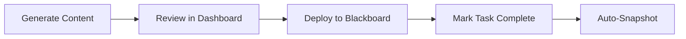

# Course Setup Dashboard Workflow

## Integration with Fall 2025 Semester Repository

This workflow document describes the integration and operation of the Course Setup Dashboard within your existing `semester-2025-fall` repository structure.

## 1. Initial Dashboard Integration

### 1.1 Directory Structure Setup

Add the dashboard module to your existing repository:

```bash
# From your semester-2025-fall root directory
mkdir -p dashboard/{static,templates,schema,templates_src,state,tools}

# Create Python requirements file for dashboard
cat > dashboard/requirements.txt << 'EOF'
Flask>=2.0
PyYAML>=6.0
Jinja2>=3.0
jsonschema>=4.0
fcntl>=0.1
EOF
```

### 1.2 Environment Configuration

Update your main `.env` file to include dashboard settings:

```bash
# Dashboard Configuration
DASH_PORT=5055
DASH_HOST=127.0.0.1
DASH_PASS=  # Optional: Set for basic auth
DASH_AUTO_SNAPSHOT=true  # Auto-commit task changes to git
```

### 1.3 Makefile Integration

Add dashboard targets to your main `Makefile`:

```makefile
# === Dashboard Targets ===
.PHONY: dash-init dash-gen dash-validate dash dash-open dash-export dash-snapshot dash-reset

# Initialize dashboard environment
dash-init: venv
	@echo "→ Setting up dashboard environment..."
	$(PYTHON) -m pip install -r dashboard/requirements.txt
	@mkdir -p dashboard/state dashboard/templates_src build/dashboard
	@echo "✓ Dashboard initialized"

# Generate tasks from templates and course data
dash-gen: dash-validate-sources
	@echo "→ Generating tasks from templates..."
	$(PYTHON) dashboard/tools/generate_tasks.py \
		--courses dashboard/state/courses.json \
		--templates dashboard/templates_src \
		--out dashboard/state/tasks.json
	@$(MAKE) dash-validate --no-print-directory
	@echo "✓ Tasks generated successfully"

# Validate task data integrity
dash-validate:
	@echo "→ Validating task data..."
	$(PYTHON) dashboard/tools/validate.py
	@echo "✓ Validation passed"

# Run dashboard server
dash: dash-gen
	@echo "→ Starting dashboard server on http://$(DASH_HOST):$(DASH_PORT)"
	FLASK_APP=dashboard/app.py FLASK_ENV=development \
		flask run --host=$(DASH_HOST) --port=$(DASH_PORT)

# Open dashboard in browser
dash-open:
	@xdg-open http://$(DASH_HOST):$(DASH_PORT) 2>/dev/null || \
	 open http://$(DASH_HOST):$(DASH_PORT) 2>/dev/null || \
	 echo "Please open http://$(DASH_HOST):$(DASH_PORT) in your browser"

# Export dashboard data (ICS, CSV)
dash-export:
	@echo "→ Exporting dashboard data..."
	$(PYTHON) dashboard/tools/export.py
	@echo "✓ Exported to build/dashboard/"

# Create git snapshot of current state
dash-snapshot:
	@git add dashboard/state/tasks.json 2>/dev/null && \
	 git commit -m "dashboard: snapshot $(shell date -Iseconds)" 2>/dev/null || \
	 echo "No changes to snapshot"

# Reset all task statuses for new semester
dash-reset:
	@echo "→ Resetting all task statuses..."
	$(PYTHON) dashboard/tools/reset.py
	@$(MAKE) dash-snapshot --no-print-directory
	@echo "✓ All tasks reset to 'todo' status"
```

## 2. Semester Setup Workflow

### 2.1 Initial Course Data Population

**Step 1**: Generate `courses.json` from your existing course data:

```bash
# Run this Python script to convert existing data
python scripts/generate_dashboard_config.py
```

Create `scripts/generate_dashboard_config.py`:

```python
#!/usr/bin/env python3
import json
import os
from datetime import datetime

# Read existing course configurations
def main():
    courses_data = {
        "semester": "2025-fall",
        "timezone": "America/Anchorage",
        "important_dates": {
            "first_day": "2025-08-25",
            "last_day": "2025-12-13",
            "finals_window": "2025-12-08..2025-12-13",
            "drop_deadline": "2025-09-08",
            "withdrawal_deadline": "2025-11-07"
        },
        "courses": []
    }
    
    # Map from your existing course structure
    course_configs = [
        ("MATH221", "Mathematical Explorations", "74645"),
        ("MATH251", "Calculus I", "74647"),
        ("STAT253", "Applied Statistics for the Sciences", "74688")
    ]
    
    for code, title, crn in course_configs:
        course = {
            "code": code,
            "title": title,
            "crn": crn,
            "modality": "online",
            "weeks": 16,  # Fall 2025 is 16 weeks
            "blackboard": {
                "course_id": f"2025-FALL-{code}-OL1",
                "copy_from_id": f"2024-FALL-{code}-OL1",
                "links": {
                    "shell": f"https://bb.uaa.edu/ultra/courses/2025-FALL-{code}-OL1",
                    "grade_center": f"https://bb.uaa.edu/ultra/gradebook?course=2025-FALL-{code}-OL1"
                }
            }
        }
        
        # Read evaluation_tools.json if exists
        eval_path = f"content/courses/{code}/evaluation_tools.json"
        if os.path.exists(eval_path):
            with open(eval_path) as f:
                course["evaluation"] = json.load(f)
        
        courses_data["courses"].append(course)
    
    # Write dashboard configuration
    os.makedirs("dashboard/state", exist_ok=True)
    with open("dashboard/state/courses.json", "w") as f:
        json.dump(courses_data, f, indent=2)
    
    print("✓ Generated dashboard/state/courses.json")

if __name__ == "__main__":
    main()
```

### 2.2 Task Template Creation

**Step 2**: Create task templates for each workflow phase:

```yaml
# dashboard/templates_src/01_blackboard_setup.yaml
template: blackboard_setup
applies_to: ["MATH221", "MATH251", "STAT253"]
defaults:
  category: "Blackboard Setup"
  weight: 2
  tags: ["setup", "blackboard"]

tasks:
  - key: BB-REQUEST-SHELL
    title: "Request Blackboard Ultra shell creation"
    description: "Submit IT ticket for Ultra course shell: {{course.blackboard.course_id}}"
    due_offset: { days: -14, from: "semester.first_day" }
    checklist:
      - "Submit ticket with CRN {{course.crn}}"
      - "Verify instructor access granted"
      - "Confirm shell URL is active"
    
  - key: BB-COPY-CONTENT
    title: "Copy content from previous semester"
    description: "Use Ultra Copy Content from {{course.blackboard.copy_from_id}}"
    due_offset: { days: -7, from: "semester.first_day" }
    blocked_by: ["{{course.code}}-BB-REQUEST-SHELL"]
    checklist:
      - "Navigate to Course Content → Copy Content"
      - "Select source: {{course.blackboard.copy_from_id}}"
      - "Exclude: Old announcements"
      - "Exclude: Grade columns marked 'legacy'"
      - "Include: All course content and assessments"
```

```yaml
# dashboard/templates_src/02_syllabus_prep.yaml
template: syllabus_preparation
applies_to: ["MATH221", "MATH251", "STAT253"]
defaults:
  category: "Syllabus & Documentation"
  weight: 3
  tags: ["syllabus", "documentation"]

tasks:
  - key: SYLL-UPDATE-DATES
    title: "Update syllabus dates and schedule"
    description: "Update all dates in syllabus for Fall 2025 ({{semester.important_dates.first_day}} - {{semester.important_dates.last_day}})"
    due_offset: { days: -10, from: "semester.first_day" }
    checklist:
      - "Update semester dates"
      - "Update exam dates (midterm/final)"
      - "Update drop/withdrawal deadlines"
      - "Verify holiday schedule"
    
  - key: SYLL-GENERATE
    title: "Generate syllabus from templates"
    description: "Run make course COURSE={{course.code}} to generate syllabus"
    due_offset: { days: -7, from: "semester.first_day" }
    blocked_by: ["{{course.code}}-SYLL-UPDATE-DATES"]
    links:
      - name: "Syllabus Template"
        url: "file://./templates/syllabus.html.j2"
```

### 2.3 Weekly Setup Tasks

```yaml
# dashboard/templates_src/03_weekly_modules.yaml
template: weekly_module_setup
applies_to: ["MATH221", "MATH251", "STAT253"]
defaults:
  category: "Weekly Content"
  weight: 1
  tags: ["weekly", "content"]

tasks:
  - key: WEEK-01-PREP
    title: "Week 1: Introduction & Course Overview"
    description: "Prepare Week 1 module with syllabus review and introductions"
    due_offset: { days: -3, from: "semester.first_day" }
    checklist:
      - "Upload syllabus to Week 1 module"
      - "Create welcome announcement"
      - "Set up introduction discussion board"
      - "Post technology check assignment"
      - "Schedule Week 1 announcement for 8:00 AM Monday"
    
  # Generate weeks 2-16 programmatically in your template processor
```

## 3. Daily Operation Workflow

### 3.1 Morning Routine

```bash
# Start your day by checking current tasks
make dash-open

# View today's focus
# The dashboard automatically highlights:
# - Overdue items (red)
# - Due today (yellow)
# - Due this week (blue)
```

### 3.2 Task Management Flow

**Status Progression**:
```
blocked → todo → doing → review → done
```

**Typical task lifecycle**:

1. **Blocked**: Waiting on prerequisite tasks
2. **Todo**: Ready to start
3. **Doing**: Currently working on
4. **Review**: Needs verification/testing
5. **Done**: Complete

### 3.3 Automated Snapshots

When `DASH_AUTO_SNAPSHOT=true`, every task update creates a git commit:

```bash
# View task history
git log --oneline dashboard/state/tasks.json

# Revert to previous state if needed
git checkout HEAD~1 -- dashboard/state/tasks.json
make dash-validate
```

## 4. Weekly Maintenance Workflow

### 4.1 Monday: Week Preparation

```bash
# Generate weekly focus report
make dash-export
open build/dashboard/week-$(date +%U)-tasks.csv

# Update task priorities
make dash
# Use the UI to adjust weights for urgent items
```

### 4.2 Friday: Week Review

```bash
# Validate all task dependencies
make dash-validate

# Archive completed week
make dash-snapshot
git tag -a "week-$(date +%U)-complete" -m "Week $(date +%U) tasks complete"
```

## 5. Blackboard Integration Workflow

### 5.1 Content Deployment Pipeline



### 5.2 Batch Operations

Create `dashboard/tools/blackboard_batch.py`:

```python
#!/usr/bin/env python3
"""Mark all Blackboard setup tasks for a week as complete."""

import json
import sys
from datetime import datetime

def mark_week_ready(week_num, course_code=None):
    with open("dashboard/state/tasks.json", "r+") as f:
        data = json.load(f)
        
        updated = 0
        for task in data["tasks"]:
            if course_code and task["course"] != course_code:
                continue
            
            if f"WEEK-{week_num:02d}" in task["id"]:
                task["status"] = "done"
                task["history"].append({
                    "at": datetime.now().isoformat(),
                    "event": f"Batch marked Week {week_num} ready"
                })
                updated += 1
        
        f.seek(0)
        f.truncate()
        json.dump(data, f, indent=2)
    
    print(f"✓ Marked {updated} Week {week_num} tasks as done")

if __name__ == "__main__":
    week = int(sys.argv[1]) if len(sys.argv) > 1 else 1
    course = sys.argv[2] if len(sys.argv) > 2 else None
    mark_week_ready(week, course)
```

Usage:
```bash
# Mark all Week 3 tasks as complete
python dashboard/tools/blackboard_batch.py 3

# Mark only MATH221 Week 3 as complete  
python dashboard/tools/blackboard_batch.py 3 MATH221
```

## 6. Validation & Quality Checks

### 6.1 Pre-Semester Checklist

Run these validations before semester start:

```bash
# Full validation suite
make dash-validate

# Link checker (requires curl)
python dashboard/tools/linkcheck.py

# Date sanity check
python dashboard/tools/date_check.py

# Dependency graph visualization
python dashboard/tools/visualize_deps.py > build/dashboard/deps.dot
dot -Tpng build/dashboard/deps.dot -o build/dashboard/deps.png
```

### 6.2 Mid-Semester Audit

```bash
# Generate progress report
python dashboard/tools/progress_report.py

# Check for stale "doing" tasks
python -c "
import json
from datetime import datetime, timedelta
tasks = json.load(open('dashboard/state/tasks.json'))['tasks']
stale = [t for t in tasks 
         if t['status'] == 'doing' 
         and datetime.fromisoformat(t.get('history',  [{'at':'2025-01-01T00:00:00'}])[-1]['at']) 
             < datetime.now() - timedelta(days=7)]
for t in stale:
    print(f'⚠️  {t[\"id\"]}: In doing status for >7 days')
"
```

## 7. Semester Rollover Workflow

### 7.1 End of Semester Archive

```bash
# Tag final state
git tag -a "2025-fall-final" -m "Fall 2025 semester complete"

# Export full history
make dash-export
cp -r build/dashboard archive/2025-fall-dashboard/

# Generate completion report
python dashboard/tools/completion_report.py > archive/2025-fall-report.md
```

### 7.2 Prepare for Next Semester

```bash
# Reset all statuses
make dash-reset

# Shift dates for new semester (e.g., +112 days for spring)
python dashboard/tools/shift_dates.py 112

# Update semester configuration
vim dashboard/state/courses.json
# Change semester to "2026-spring"
# Update important_dates
# Update course CRNs

# Regenerate tasks
make dash-gen

# Commit clean slate
git add -A
git commit -m "Prepare dashboard for Spring 2026"
```

## 8. Troubleshooting

### Common Issues and Solutions

| Issue | Solution |
|-------|----------|
| Port 5055 already in use | `lsof -i :5055` then kill the process, or change `DASH_PORT` |
| Tasks not updating | Check file lock: `lsof dashboard/state/tasks.json` |
| Circular dependencies | Run `make dash-validate` to identify cycle |
| Lost changes | Recover from git: `git log dashboard/state/tasks.json` |
| Slow dashboard | Reduce task count or archive completed courses |

### Debug Mode

```bash
# Enable Flask debug mode
FLASK_DEBUG=1 make dash

# Verbose task generation
python dashboard/tools/generate_tasks.py --verbose \
    --courses dashboard/state/courses.json \
    --templates dashboard/templates_src \
    --out dashboard/state/tasks.json
```

## 9. Integration Points

### 9.1 Connect to Existing Build System

Update your main build pipeline:

```makefile
# In your root Makefile
all: init validate syllabi schedules packages dash-gen

# Add dashboard validation to main validation
validate: validate-json dash-validate

# Include dashboard exports in distributions
dist: all dash-export
	cp -r build/dashboard build/dist/
```

### 9.2 Calendar Integration

```bash
# Subscribe to task calendar
make dash-export
# Import build/dashboard/tasks.ics into your calendar app

# Or serve it dynamically
python -m http.server 8000 --directory build/dashboard
# Calendar URL: http://localhost:8000/tasks.ics
```

## 10. Best Practices

1. **Daily**: Check dashboard, update task statuses
2. **Weekly**: Review blocked tasks, adjust priorities  
3. **Biweekly**: Run link checker, validate dependencies
4. **Monthly**: Archive snapshots, generate reports
5. **Per Semester**: Full reset and rollover procedure

## Quick Reference Card

```bash
# Essential commands
make dash           # Start dashboard
make dash-gen       # Regenerate tasks
make dash-validate  # Check integrity
make dash-export    # Export ICS/CSV
make dash-snapshot  # Git snapshot
make dash-reset     # Reset for new term

# Keyboard shortcuts (in dashboard)
j/k     - Navigate tasks
1-5     - Set status (1=todo...5=done)
Space   - Toggle checklist
/       - Search tasks
?       - Show help
```

---

This workflow integrates the dashboard system into your existing semester repository while maintaining your current structure and tooling. The dashboard becomes another build target alongside your syllabus and content generation, providing a unified course management system.
